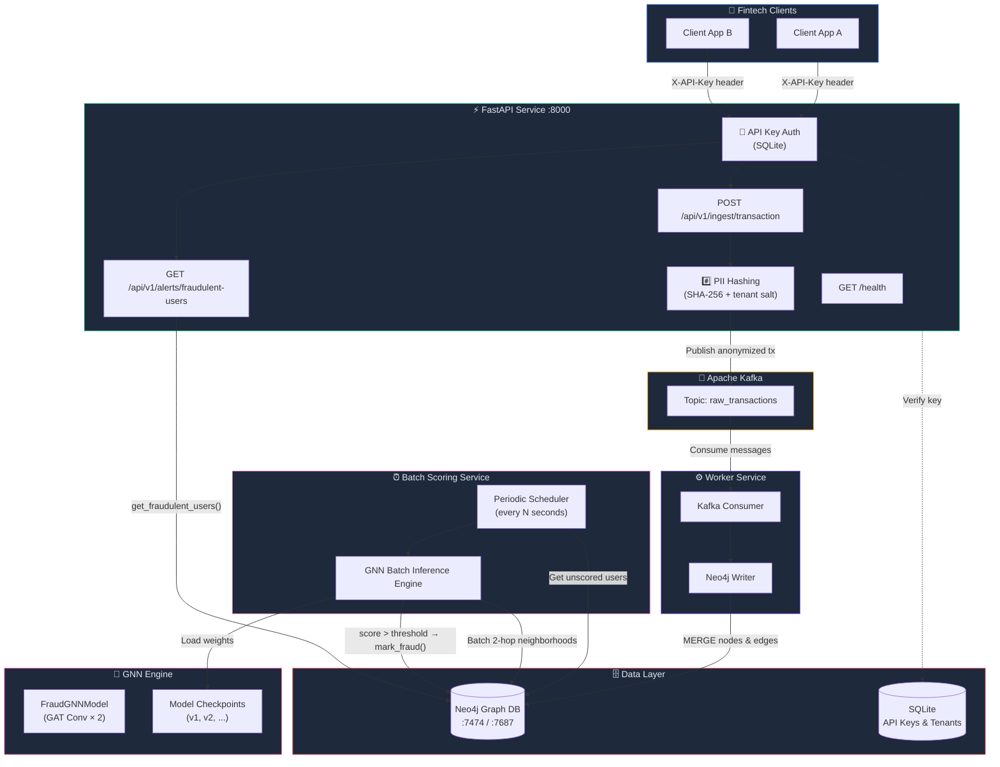
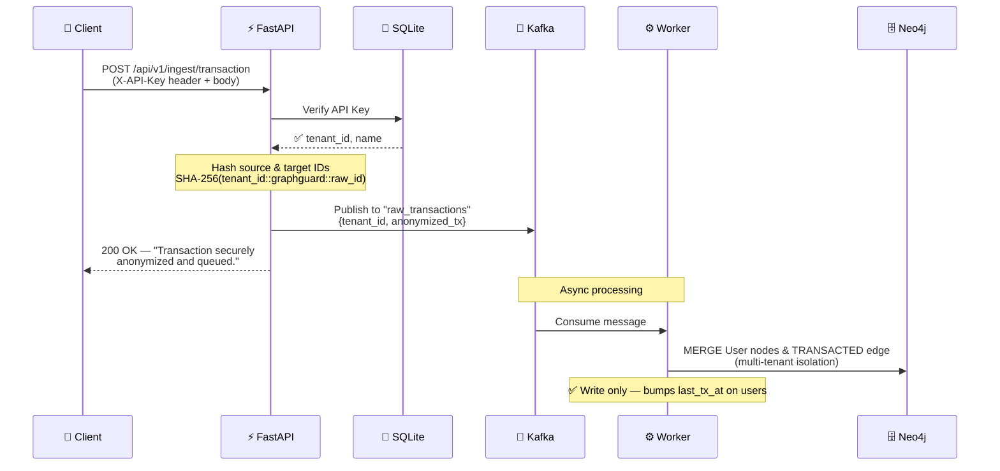
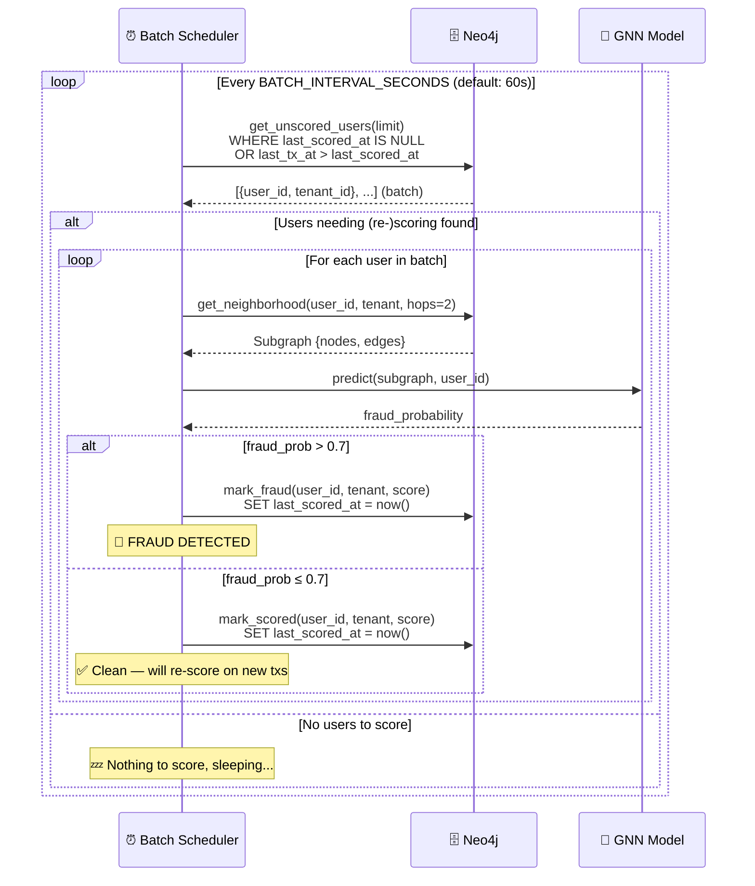
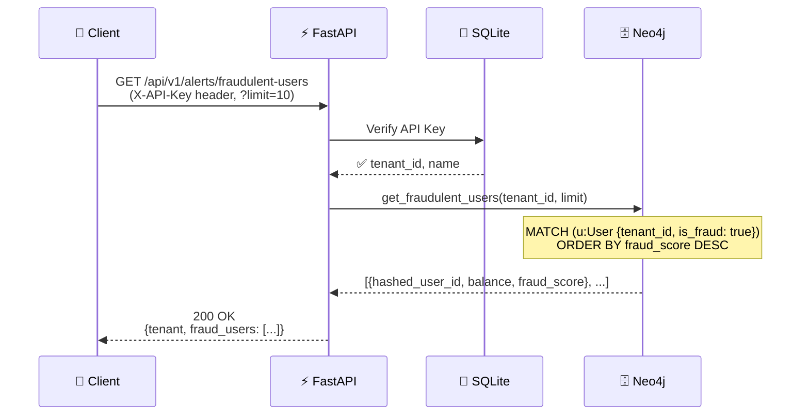
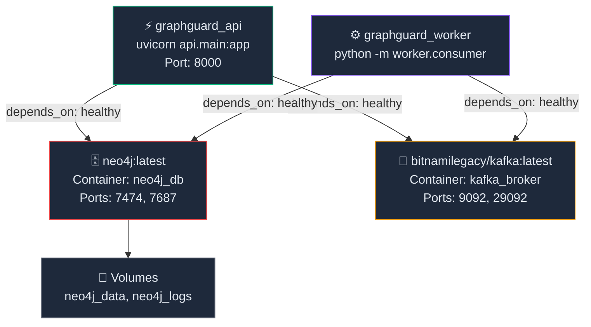

# GraphGuard — Project Workflow Diagrams

## 1. High-Level System Architecture

---

## 2. Phase 1 — Simulation & GNN Training Pipeline

```mermaid
flowchart LR
    subgraph Simulation["🎭 Mesa Simulation"]
        direction TB
        NORMAL["NormalAgent × 50<br/>Random txs, 10% chance"]
        FRAUD["FraudAgent × 10<br/>Circular txs, 30% chance"]
        TM["TransactionModel<br/>(step loop)"]
        NORMAL & FRAUD --> TM
    end

    subgraph Export["📤 Data Export"]
        USERS["get_users()<br/>id, is_fraud, balance"]
        TXS["get_transactions()<br/>tx_id, source, target,<br/>amount, timestamp, is_fraud"]
    end

    subgraph GraphDB["🗄️ Neo4j"]
        INSERT_U["insert_users()"]
        INSERT_T["insert_transactions()"]
        GRAPH[("Graph<br/>:User nodes<br/>:TRANSACTED edges")]
    end

    subgraph Training["🧠 GNN Training"]
        DATASET["FraudGraphDataset<br/>(load from Neo4j)"]
        SPLIT["Train / Val / Test<br/>mask split"]
        TRAIN_LOOP["Training Loop<br/>(100 epochs, Adam)"]
        EVAL["Evaluation<br/>F1, Precision, Recall, AUC"]
        SAVE["💾 Save Checkpoint<br/>fraud_gnn_model_v1.pth"]
    end

    TM --> USERS & TXS
    USERS --> INSERT_U --> GRAPH
    TXS --> INSERT_T --> GRAPH
    GRAPH --> DATASET --> SPLIT --> TRAIN_LOOP --> EVAL --> SAVE

    style Simulation fill:#0f172a,stroke:#3b82f6,color:#e2e8f0
    style Export fill:#0f172a,stroke:#06b6d4,color:#e2e8f0
    style GraphDB fill:#0f172a,stroke:#ef4444,color:#e2e8f0
    style Training fill:#0f172a,stroke:#a855f7,color:#e2e8f0
```

---

## 3. Phase 2 — Transaction Ingestion & Batch Fraud Scoring

### 3a. Transaction Ingestion (Write Path)

### 3b. Batch Fraud Scoring (Scoring Path)

> **Re-scoring logic:** A user is picked up for scoring if `last_scored_at IS NULL`
> (never scored) **or** `last_tx_at > last_scored_at` (new transactions arrived since
> last score). This means a previously-clean user **will** be re-evaluated when
> new suspicious activity occurs.

---

## 4. Phase 2 — Fraud Query Flow

---

## 5. Docker Services & Dependencies

---

## Key File Mapping

| Component | Key Files |
|---|---|
| **API Service** | [main.py](file:///c:/Document/fraud-detech/backend/api/main.py), [security.py](file:///c:/Document/fraud-detech/backend/api/security.py), [schemas.py](file:///c:/Document/fraud-detech/backend/api/schemas.py) |
| **API Routers** | [ingest.py](file:///c:/Document/fraud-detech/backend/api/routers/ingest.py), [query.py](file:///c:/Document/fraud-detech/backend/api/routers/query.py) |
| **Worker** | [consumer.py](file:///c:/Document/fraud-detech/backend/worker/consumer.py) |
| **Database** | [neo4j_client.py](file:///c:/Document/fraud-detech/backend/db/neo4j_client.py), [init_db.py](file:///c:/Document/fraud-detech/backend/api/init_db.py) |
| **GNN Engine** | [model.py](file:///c:/Document/fraud-detech/backend/gnn/model.py), [train.py](file:///c:/Document/fraud-detech/backend/gnn/train.py), [inference.py](file:///c:/Document/fraud-detech/backend/gnn/inference.py) |
| **Simulation** | [model.py](file:///c:/Document/fraud-detech/backend/simulation/model.py), [agents.py](file:///c:/Document/fraud-detech/backend/simulation/agents.py) |
| **Infrastructure** | [docker-compose.yaml](file:///c:/Document/fraud-detech/backend/docker-compose.yaml), [Dockerfile](file:///c:/Document/fraud-detech/backend/Dockerfile) |
